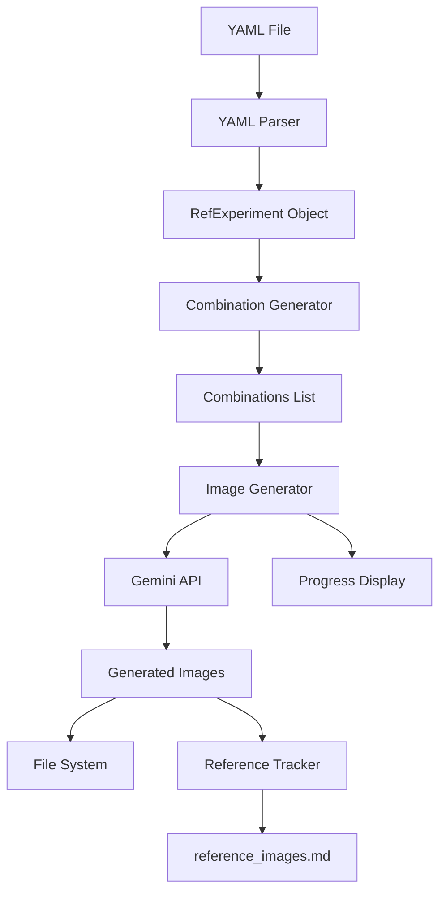

# Reference Experiments Technical Architecture

## Overview

Reference Experiments is a feature for systematic prompt variation testing in the Comic Book Creator. It allows users to define parameterized prompts and automatically generate multiple image variations using Gemini Flash 2.5 Image API.

## Core Components

### 1. Reference Experiment Parser (`src/refexp/parser.py`)

**Purpose**: Parse YAML files containing prompt templates and variable definitions

**Key Classes & Methods**:
```python
class RefExperiment:
    name: str
    description: Optional[str]
    prompt_template: str
    variables: Dict[str, List[str]]
    settings: Dict[str, Any]
    image_settings: Dict[str, Any]
    source_file: str
    metadata: Dict[str, Any]

class RefExpParser:
    def parse_file(filepath: str) -> RefExperiment
    def validate_template(template: str, variables: Dict) -> List[str]
    def load_yaml(filepath: str) -> Dict[str, Any]
    def validate_schema(data: Dict) -> None
```

**Parsing Logic**:
- Load YAML file using PyYAML (already in requirements.txt)
- Extract prompt template, variables, and settings
- Validate YAML schema and structure
- Ensure all template variables are defined
- Support optional metadata fields

### 2. Combination Generator (`src/refexp/combinator.py`)

**Purpose**: Generate prompt combinations from templates and variables

**Key Classes & Methods**:
```python
class Combination:
    id: int
    prompt: str
    variables: Dict[str, str]
    hash: str  # For deduplication
    metadata: Dict[str, Any]

class CombinationGenerator:
    def generate_combinations(
        experiment: RefExperiment,
        limit: Optional[int] = None,
        seed: Optional[int] = None
    ) -> List[Combination]
    
    def generate_all(experiment: RefExperiment) -> List[Combination]
    def generate_random(experiment: RefExperiment, count: int, seed: int) -> List[Combination]
```

**Generation Strategies**:
- **All**: Cartesian product of all variable values
- **Random**: Random sampling with optional seed
- **Smart Sampling**: Ensure coverage of all values when possible

### 3. Image Generator Integration (`src/refexp/generator.py`)

**Purpose**: Interface with existing Gemini API client for batch image generation

**Key Classes & Methods**:
```python
class RefExpImageGenerator:
    def __init__(self, gemini_client: GeminiClient, config: Config)
    
    async def generate_images(
        combinations: List[Combination],
        progress_callback: Optional[Callable] = None
    ) -> List[GeneratedImage]
    
    async def generate_single_image(
        combination: Combination
    ) -> GeneratedImage

class GeneratedImage:
    combination: Combination
    image_data: bytes
    filepath: str
    timestamp: datetime
    generation_metadata: Dict[str, Any]
```

**Integration Points**:
- Reuses `GeminiClient` from `src/api/gemini_client.py`
- Leverages existing rate limiting from `src/api/rate_limiter.py`
- Uses configuration from `src/config/loader.py`

### 4. Reference Images Tracker (`src/refexp/tracker.py`)

**Purpose**: Maintain `reference_images.md` with experiment history

**Key Classes & Methods**:
```python
class ReferenceTracker:
    def __init__(self, output_dir: str)
    
    def update_reference_doc(
        experiment_session: ExperimentSession
    ) -> None
    
    def format_markdown_entry(
        image: GeneratedImage,
        experiment: RefExperiment
    ) -> str
    
    def create_backup() -> str

class ExperimentSession:
    experiment: RefExperiment
    generated_images: List[GeneratedImage]
    start_time: datetime
    end_time: datetime
    total_combinations: int
    generated_count: int
```

**Markdown Format**:
- Structured sections per experiment session
- Image paths relative to project root
- Metadata including timestamps and model info
- Variable values for each combination

### 5. CLI Command (`src/cli_refexp.py`)

**Purpose**: Command-line interface for reference experiments

**Command Structure**:
```python
@click.command()
@click.argument('yaml_file', type=click.Path(exists=True))
@click.option('--iterations', default='10', help='Number or "all"')
@click.option('--output', '-o', default='output/reference_experiments')
@click.option('--seed', type=int, help='Random seed')
@click.option('--quality', type=click.Choice(['low', 'medium', 'high']), default='high')
@click.option('--parallel', type=int, default=3, help='Concurrent generations')
def ref_exp(yaml_file, iterations, output, seed, quality, parallel):
    """Run reference experiments from a YAML file."""
```

**Integration with Main CLI**:
- Added as subcommand to main `cli.py`
- Shares Rich console UI components
- Uses same progress tracking system

## Data Flow



## File Organization

```
comic_book_creator/
├── src/
│   ├── refexp/
│   │   ├── __init__.py
│   │   ├── parser.py         # .ref file parsing
│   │   ├── combinator.py     # Combination generation
│   │   ├── generator.py      # Image generation orchestration
│   │   ├── tracker.py        # Reference document management
│   │   └── models.py         # Data models
│   └── cli_refexp.py         # CLI command
├── tests/
│   └── test_refexp/
│       ├── test_parser.py
│       ├── test_combinator.py
│       ├── test_generator.py
│       └── test_tracker.py
├── output/
│   └── reference_experiments/
│       └── [generated images]
├── reference_images.md       # Experiment history
└── examples/
    └── reference_experiments/
        ├── character_styles.yaml
        ├── scene_lighting.yaml
        └── composition_tests.yaml
```

## Integration with Existing System

### API Client Integration

```python
# In src/refexp/generator.py
from src.api.gemini_client import GeminiClient

class RefExpImageGenerator:
    def __init__(self, gemini_client: GeminiClient, config: Config):
        self.client = gemini_client
        self.config = config
    
    async def generate_single_image(self, combination: Combination) -> GeneratedImage:
        # Use existing generate_image method
        image_data = await self.client.generate_image(
            prompt=combination.prompt,
            width=self.config.generation.panel_size[0],
            height=self.config.generation.panel_size[1],
            quality=self.config.generation.quality
        )
        return GeneratedImage(...)
```

### Configuration Extension

Add to `src/config/loader.py`:
```python
@dataclass
class ReferenceExperimentConfig:
    max_variables: int = 10
    max_values_per_variable: int = 100
    max_total_combinations: int = 10000
    default_iterations: int = 10
    output_directory: str = "output/reference_experiments"
    concurrent_generations: int = 3
    save_metadata: bool = True

@dataclass
class Config:
    # ... existing fields ...
    reference_experiments: ReferenceExperimentConfig = field(default_factory=ReferenceExperimentConfig)
```

## Error Handling Strategy

### Parser Errors
```python
class RefExpParseError(Exception):
    """Raised when YAML file parsing fails."""
    pass

class RefExpValidationError(Exception):
    """Raised when template validation fails."""
    pass

class RefExpSchemaError(Exception):
    """Raised when YAML schema is invalid."""
    pass
```

### Generation Errors
- Implement exponential backoff for API rate limits
- Continue with remaining combinations on individual failures
- Log all errors with context
- Save partial results

### Recovery Mechanism
```python
class ExperimentCheckpoint:
    """Save and resume experiment progress."""
    def save_checkpoint(session: ExperimentSession) -> None
    def load_checkpoint(experiment_id: str) -> Optional[ExperimentSession]
    def resume_from_checkpoint(checkpoint: ExperimentCheckpoint) -> None
```

## Performance Optimization

### Concurrency Control
```python
class ConcurrentImageGenerator:
    def __init__(self, max_workers: int = 3):
        self.semaphore = asyncio.Semaphore(max_workers)
        self.rate_limiter = RateLimiter(requests_per_minute=10)
    
    async def generate_batch(self, combinations: List[Combination]):
        tasks = [self._generate_with_limit(c) for c in combinations]
        return await asyncio.gather(*tasks, return_exceptions=True)
```

### Memory Management
- Stream large combination sets using generators
- Process in batches to avoid memory overflow
- Clear image data after saving to disk

### Caching Strategy
```python
class PromptCache:
    """Cache generated images by prompt hash."""
    def get_cached_image(prompt_hash: str) -> Optional[bytes]
    def cache_image(prompt_hash: str, image_data: bytes) -> None
    def clear_old_cache(days: int = 7) -> None
```

## Testing Strategy

### Unit Tests
```python
# test_parser.py
def test_parse_valid_yaml_file()
def test_parse_with_settings()
def test_invalid_yaml_schema()
def test_undefined_variables()
def test_optional_fields()

# test_combinator.py
def test_generate_all_combinations()
def test_generate_random_with_seed()
def test_max_combinations_limit()
def test_settings_override()

# test_generator.py
def test_image_generation_mock()
def test_concurrent_generation()
def test_error_recovery()
def test_image_settings_application()

# test_tracker.py
def test_markdown_formatting()
def test_backup_creation()
def test_append_to_existing()
def test_metadata_inclusion()
```

### Integration Tests
```python
# test_integration.py
async def test_end_to_end_experiment()
async def test_resume_from_checkpoint()
async def test_rate_limiting()
```

## Configuration Schema

```yaml
reference_experiments:
  # Limits
  max_variables: 10
  max_values_per_variable: 100
  max_total_combinations: 10000
  
  # Defaults
  default_iterations: 10
  default_quality: high
  
  # Output
  output_directory: "output/reference_experiments"
  filename_pattern: "exp_{timestamp}_{id}_{vars}"
  save_metadata: true
  
  # Performance
  concurrent_generations: 3
  api_rate_limit: 10  # per minute
  retry_attempts: 3
  retry_delay: 5  # seconds
  
  # Caching
  enable_cache: true
  cache_directory: ".cache/refexp"
  cache_ttl_days: 7
```

## Future Enhancements

1. **Web UI**: Browser-based interface for creating and viewing experiments
2. **Comparison Tools**: Side-by-side image comparison interface
3. **Analytics**: Statistical analysis of which variables affect output most
4. **Templates Library**: Pre-built YAML templates for common use cases
5. **Export Formats**: Export experiments as datasets for ML training
6. **Version Control**: Track changes to YAML files and link to generated images
7. **Collaborative Features**: Share experiments and results with team members
8. **YAML Schema Validation**: JSON Schema for YAML validation
9. **Variable Dependencies**: Support conditional variables based on other values